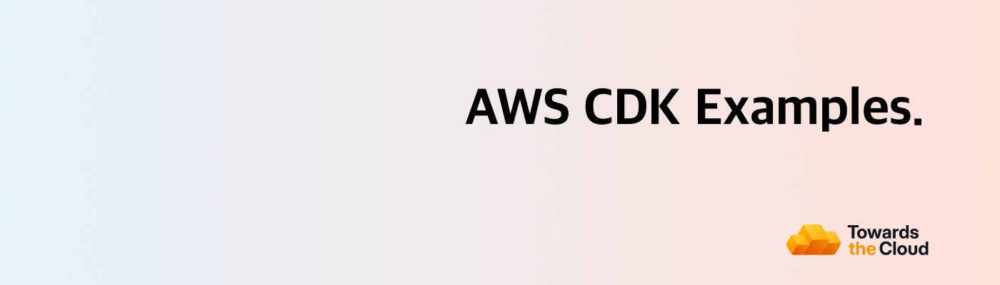

# [](https://towardsthecloud.com)

# AWS CDK Examples

A collection of AWS CDK code samples crafted in TypeScript, featured on my blog at https://towardsthecloud.com/blog

<!-- TIP-LIST:START -->
> [!TIP]
> **Towards the Cloud runs the AWS foundation for modern product teams. This means your team ships faster, slashes AWS spend, and stay audit-ready without having to hire a platform squad.**
>
> Unsure where to start? Book a free AWS Account Review. We’ll analyse your AWS environment, hand you a security & cost report, and you decide whether to act on it yourself or have us execute. No pressure, no retainer required up front.
>
> <a href="https://cal.com/towardsthecloud/aws-account-review"></a>
>
> <details>
> <summary>☁️ <strong>See how we turn AWS chaos into a compliant, cost-efficient platform…</strong></summary>
> <br/>
>
> ### The problem: AWS complexity compounds fast
>
> Ad‑hoc builds become 40–60% overspend, unmonitored security gaps put customer data at risk, and engineers burn out running infrastructure instead of shipping products.
>
> ### Our managed foundation keeps you moving forward
>
> - ✅ **Compliant Landing Zone** – [Multi-account AWS CDK deployment](https://towardsthecloud.com/services/aws-landing-zone) with 100% [CIS benchmark](https://docs.aws.amazon.com/securityhub/latest/userguide/cis-aws-foundations-benchmark.html) coverage,
> centralized logging, and SSO-ready access control.
> - ✅ **Production-ready CDK components** – Pre-hardened building blocks so teams launch new services without reinventing best practices.
> - ✅ **CI/CD with safe rollbacks** – GitOps workflows and governed pipelines that let you release faster with confidence.
> - ✅ **Quarterly cost & security reviews** – [Cost Optimisation](https://towardsthecloud.com/services/aws-cost-optimization) plus [Security Reviews](https://towardsthecloud.com/services/aws-security-review)
> delivered proactively.
> - ✅ **Fractional Cloud Engineer** – On-demand expertise from an architect who implemented enterprise-grade AWS infrastructure for over a decade.
>
> ### Outcomes our customers see
>
> - **30%+ lower AWS bill** – Continuous oversight prevents expensive drift ([30–60% documented savings](https://towardsthecloud.com/services/aws-cost-optimization#case-study)).
> - **SOC 2 / HIPAA acceleration** – Guardrails, logging, and evidence packs ready on day one.
> - **Audit-ready every quarter** – Automated monitoring plus recurring reviews keep findings under control.
> - **Faster product velocity** – Engineers build features, not managing infrastructure.
> - **Headcount leverage** – A [flexible retainer](https://towardsthecloud.com/pricing) replaces the cost of a full-time platform team.
>
> **Proof:** Y Combinator startup Accolade used our Landing Zone to [earn SOC 2 in record time](https://towardsthecloud.com/blog/aws-landing-zone-case-study-accolade):
>
> *“We achieved a perfect security score in days, not months.”* — Galen Simmons, CEO
>
> Ready to see where your AWS account stands? Grab a spot while they’re available:
>
> <a href="https://cal.com/towardsthecloud/aws-account-review"></a>
>
> </details>
<!-- TIP-LIST:END -->

## How to run the code from the examples

To run a Typescript example, execute the following:

```
$ npm install -g aws-cdk
$ cd EXAMPLE_DIRECTORY
$ npm install
$ cdk synth
$ cdk deploy
```

Then, to dispose of the stack/s afterwards

```
$ cdk destroy
```

## Table of Contents

| AWS CDK Example                                                                                    | Description                                                           | Blogpost link                                                                                            |
| -------------------------------------------------------------------------------------------------- | --------------------------------------------------------------------- | -------------------------------------------------------------------------------------------------------- |
| [application-load-balanced-fargate-service](./application-load-balanced-fargate-service/README.md) | Create an Application Load Balanced Fargate Service in AWS CDK        | [Click here](https://towardsthecloud.com/aws-cdk-application-load-balanced-fargate-service)              |
| [cloudfront-s3-origin](./cloudfront-s3-origin/README.md)                                           | Create a CloudFront distribution with an S3 bucket as origin          | .                                                                                                        |
| [custom-role-lambda-function](./custom-role-lambda-function/README.md)                             | Create a custom IAM role for an AWS Lambda function                   | [Click here](https://towardsthecloud.com/aws-cdk-custom-role-lambda-function)                            |
| [aws-cdk-dependson-relation](./custom-role-lambda-function/README.md)                              | Create a DependsOn relation between resources in AWS CDK              | [Click here](https://towardsthecloud.com/aws-cdk-dependson-relation)                                     |
| [openid-connect-bitbucket](./openid-connect-bitbucket/README.md)                                   | Create a Bitbucket OpenID Connect (OIDC) provider in AWS CDK          | [Click here](https://towardsthecloud.com/aws-cdk-openid-connect-bitbucket)                               |
| [openid-connect-github](./openid-connect-github/README.md)                                         | Create a GitHub OpenID Connect (OIDC) provider in AWS CDK             | [Click here](https://towardsthecloud.com/aws-cdk-openid-connect-github)                                  |
| [rds-with-cloudwatch-alarms](./rds-with-cloudwatch-alarms/README.md)                               | Create an Amazon RDS instance with custom CloudWatch alarms           | .                                                                                                        |
| [scheduled-fargate-task](./scheduled-fargate-task/README.md)                                       | Create a Scheduled Fargate Task example in AWS CDK                    | [Click here](https://towardsthecloud.com/aws-cdk-scheduled-fargate-task)                                 |
| [scheduled-rds-stop-and-start](./scheduled-rds-stop-and-start/README.md)                           | Create a Scheduled stop and start function for an Amazon RDS Instance | [Click here](https://aws.amazon.com/blogs/database/schedule-amazon-rds-stop-and-start-using-aws-lambda/) |
| [share-resources-across-stacks](./share-resources-across-stacks/README.md)                         | Create a stack where you share resources to another stack             | [Click here](https://towardsthecloud.com/share-resources-across-stacks-aws-cdk)                          |

---

## Author

[Danny Steenman](https://towardsthecloud.com/about)

[](https://www.linkedin.com/company/towardsthecloud)
[](https://twitter.com/dannysteenman)
[](https://github.com/dannysteenman)
