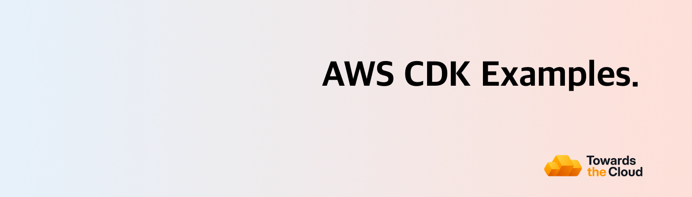

# [](https://towardsthecloud.com)

# AWS CDK Examples

A collection of AWS CDK code samples crafted in TypeScript, featured on my blog at https://towardsthecloud.com/blog

<!-- TIP-LIST:START -->
> [!TIP]
> **We eliminate AWS complexity so you ship faster, spend less, and stay compliant.**
>
> Our managed AWS service gives you three things: a production-grade AWS CDK Landing Zone with built-in compliance controls, proactive monitoring that stops cost waste and security drift, and senior AWS expertise that speeds up your team's delivery.
>
> Book a free demo to see where you stand and what we'd fix first:
>
> <a href="https://towardsthecloud.com/services/aws-cdk-landing-zone#cta"></a>
>
> <details>
> <summary>⚡ <strong>See the symptoms of a missing AWS foundation and how we solve them</strong></summary>
> <br/>
>
> AWS starts simple. Then you scale: production and staging blur together, resources multiply without owners, IAM policies accumulate exceptions, security findings pile up in backlogs, and the bill climbs month after month.
>
> Those are symptoms of a missing AWS foundation. Without one, your developers spend more time fixing problems than shipping features.
>
> **We provide that foundation and own it entirely, so your team focuses on shipping, not firefighting.**
>
> ### Here's what's included:
>
> **1. We Provision a Secure [AWS CDK Landing Zone](https://towardsthecloud.com/services/aws-cdk-landing-zone) That Accelerates Compliance**
> - Multi-account architecture with security controls and compliance guardrails from day one
> - Scores 100% on the [CIS AWS Foundations Benchmark](https://docs.aws.amazon.com/securityhub/latest/userguide/cis-aws-foundations-benchmark.html) and 96% on [AWS Foundational Security Best Practices](https://docs.aws.amazon.com/securityhub/latest/userguide/fsbp-standard.html)
> - Those benchmarks map straight to **SOC 2**, **HIPAA**, and **PCI-DSS** controls, cutting months from your compliance timeline
>
> **2. We Monitor Proactively to Stop Cost Waste and Security Drift**
> - Quarterly cost reviews catch unattached volumes, oversized instances, and orphaned resources before they compound. AWS spend drops 20-30% on average, with [outliers hitting 60+%](https://towardsthecloud.com/services/aws-cost-optimization#case-study)
> - Continuous security monitoring across all accounts catches misconfigurations immediately. You get alerts while issues are still fixable, not after they're breaches
>
> **3. We Provide Senior AWS Expertise That Speeds Up Delivery**
> - Your developers get production-ready IaC templates for common patterns: multi-AZ applications, event-driven architectures, secure data pipelines. What takes weeks of research ships in hours
> - Architecture guidance on VPC design, IAM policies, disaster recovery, and observability from engineers who've solved these problems at enterprise scale
>
> [*"We achieved a perfect security score in days, not months."*](https://towardsthecloud.com/blog/case-study-accolade)
> *Galen Simmons, CEO of Accolade (Y Combinator startup)*
>
> </details>
<!-- TIP-LIST:END -->

## How to run the code from the examples

To run a Typescript example, execute the following:

```
$ npm install -g aws-cdk
$ cd EXAMPLE_DIRECTORY
$ npm install
$ cdk synth
$ cdk deploy
```

Then, to dispose of the stack/s afterwards

```
$ cdk destroy
```

## Table of Contents

| AWS CDK Example                                                                                    | Description                                                           | Blogpost link                                                                                            |
| -------------------------------------------------------------------------------------------------- | --------------------------------------------------------------------- | -------------------------------------------------------------------------------------------------------- |
| [application-load-balanced-fargate-service](./application-load-balanced-fargate-service/README.md) | Create an Application Load Balanced Fargate Service in AWS CDK        | [Click here](https://towardsthecloud.com/aws-cdk-application-load-balanced-fargate-service)              |
| [cloudfront-s3-origin](./cloudfront-s3-origin/README.md)                                           | Create a CloudFront distribution with an S3 bucket as origin          | .                                                                                                        |
| [custom-role-lambda-function](./custom-role-lambda-function/README.md)                             | Create a custom IAM role for an AWS Lambda function                   | [Click here](https://towardsthecloud.com/aws-cdk-custom-role-lambda-function)                            |
| [aws-cdk-dependson-relation](./custom-role-lambda-function/README.md)                              | Create a DependsOn relation between resources in AWS CDK              | [Click here](https://towardsthecloud.com/aws-cdk-dependson-relation)                                     |
| [openid-connect-bitbucket](./openid-connect-bitbucket/README.md)                                   | Create a Bitbucket OpenID Connect (OIDC) provider in AWS CDK          | [Click here](https://towardsthecloud.com/aws-cdk-openid-connect-bitbucket)                               |
| [openid-connect-github](./openid-connect-github/README.md)                                         | Create a GitHub OpenID Connect (OIDC) provider in AWS CDK             | [Click here](https://towardsthecloud.com/aws-cdk-openid-connect-github)                                  |
| [rds-with-cloudwatch-alarms](./rds-with-cloudwatch-alarms/README.md)                               | Create an Amazon RDS instance with custom CloudWatch alarms           | .                                                                                                        |
| [scheduled-fargate-task](./scheduled-fargate-task/README.md)                                       | Create a Scheduled Fargate Task example in AWS CDK                    | [Click here](https://towardsthecloud.com/aws-cdk-scheduled-fargate-task)                                 |
| [scheduled-rds-stop-and-start](./scheduled-rds-stop-and-start/README.md)                           | Create a Scheduled stop and start function for an Amazon RDS Instance | [Click here](https://aws.amazon.com/blogs/database/schedule-amazon-rds-stop-and-start-using-aws-lambda/) |
| [share-resources-across-stacks](./share-resources-across-stacks/README.md)                         | Create a stack where you share resources to another stack             | [Click here](https://towardsthecloud.com/share-resources-across-stacks-aws-cdk)                          |

---

## Author

[Danny Steenman](https://towardsthecloud.com/about)

[](https://www.linkedin.com/company/towardsthecloud)
[](https://twitter.com/dannysteenman)
[](https://github.com/dannysteenman)
